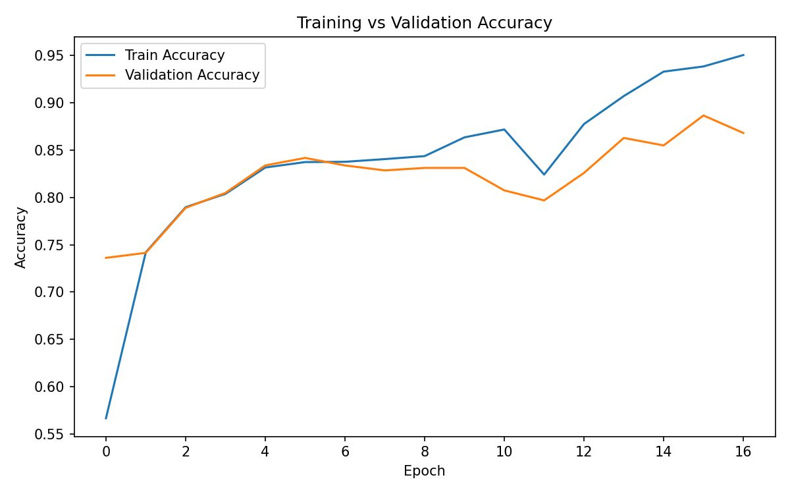
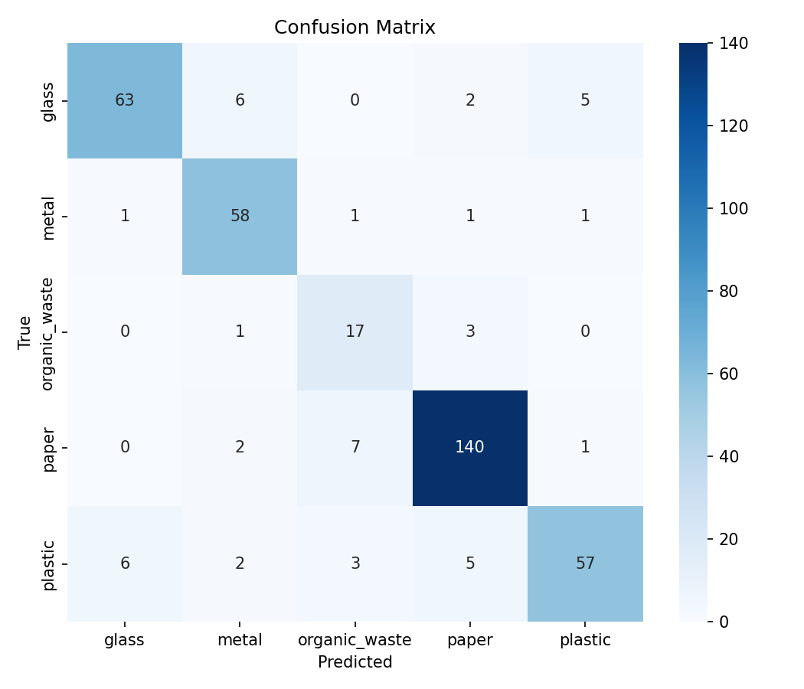
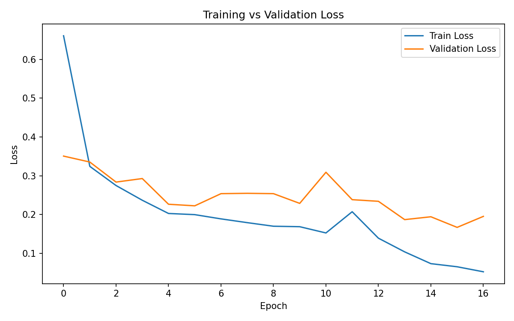

# Garbage Classification System - Project Documentation

**Date:** May 2026  
**Project Status:** Deployed on Railway  
**Repository:** https://github.com/Mythrasviel02/image.git

---

## 1. Project Overview

### 1.1 Title
Garbage Classification System using MobileNetV2 and Flask

### 1.2 Description
This project is a web-based garbage classification system that automatically identifies waste images and classifies them into five categories: Plastic, Paper, Glass, Metal, and Organic Waste. The system addresses the need for fast and accurate waste sorting, which supports better recycling and waste management practices. By utilizing deep learning and transfer learning with MobileNetV2, the system provides an accessible interface for users to upload images and receive predictions with confidence scores and top-3 predictions.

### 1.3 Objectives

**Primary Objectives:**
- Build an image classification model that accurately classifies garbage into five waste categories with at least 85% validation accuracy.
- Develop a responsive and user-friendly Flask web application where users can upload images and receive predictions with confidence metrics.
- Train and evaluate the model using transfer learning with MobileNetV2 to leverage pretrained features for improved performance on limited data.

**Secondary Objectives:**
- Provide confidence scores, top-3 predictions, and low-confidence alerts for better interpretability and user guidance.
- Generate comprehensive evaluation metrics including accuracy, precision, recall, F1-score, and confusion matrices for model analysis.
- Deploy the system on a free cloud platform (Railway) for public access and demonstration.
- Implement class balancing techniques (oversampling, class weighting) to improve minority class performance.
- Test advanced loss functions (focal loss) to handle imbalanced data more effectively.

---

## 2. Data Collection and Preparation

### 2.1 Data Source

**Source:** Custom garbage classification image dataset organized in folder structure within the project workspace.

**Description:** The dataset contains images of garbage items grouped into source folders:
- Cardboard
- Glass
- Metal
- Paper
- Plastic
- Trash

**Total Images in Dataset:** Approximately 1,766 training images post-collection, expanded to 3,485 after oversampling.

**Class Mapping:** During preprocessing, raw folders are mapped to five final classes:
- `plastic` → Plastic
- `paper` + `cardboard` → Paper
- `glass` → Glass
- `metal` → Metal
- `trash` → Organic Waste

### 2.2 Data Preprocessing

**Steps Involved:**

1. **Collection:** Images were collected from raw dataset folders and cataloged by original class.

2. **Train/Val/Test Split:** Dataset was split using a 70/15/15 ratio:
   - Training: 70% (used for model learning)
   - Validation: 15% (used for early stopping and hyperparameter tuning)
   - Testing: 15% (used for final evaluation)

3. **Image Resizing:** All images resized to 224 × 224 pixels to match MobileNetV2 input requirements.

4. **Normalization:** Pixel values normalized using MobileNetV2 preprocessing standards (mean/std normalization).

5. **Data Augmentation:** Applied online augmentation during training:
   - Random horizontal flip
   - Random rotation (0-25 degrees)
   - Random zoom (0-20%)
   - Random translation (0-12%)
   - Random contrast adjustment (0-18%)

6. **Class Balancing:** 
   - Computed class weights using scikit-learn's `compute_class_weight` with "balanced" strategy.
   - Applied oversampling: underrepresented classes duplicated until matching the largest class (697 samples each).
   - Class weights and oversampling combined during training to improve minority class performance.

**Tools/Techniques Used:**
- TensorFlow and Keras for preprocessing and training
- `tf.keras.utils.image_dataset_from_directory` for efficient data loading
- `tf.keras.preprocessing.image` for augmentation layers
- `sklearn.model_selection.train_test_split` for stratified splitting
- `sklearn.utils.class_weight.compute_class_weight` for class weighting

---

## 3. Model Selection and Training

### 3.1 Model Architecture

**Chosen Model:** MobileNetV2 with Transfer Learning

**Architecture Details:**
- Pretrained MobileNetV2 backbone from ImageNet
- Global average pooling layer
- Dropout layer (20%) for regularization
- Dense output layer with 5 units (one per class) with softmax activation
- Input shape: 224 × 224 × 3 (RGB images)
- Online data augmentation layer at the input stage

**Justification:**
MobileNetV2 was selected because:
1. **Efficiency:** Lightweight and fast, suitable for both training and deployment.
2. **Accuracy:** Achieves strong performance on image classification tasks despite reduced model size.
3. **Transfer Learning:** Pretrained on ImageNet provides robust feature extraction for garbage classification without requiring massive datasets.
4. **Deploy-friendly:** Model size is manageable for free cloud deployments.
5. **Proven Track Record:** Widely used in production systems for image classification.

### 3.2 Training Process

**Training Data:** 70% of the prepared dataset (expanded to approximately 2,450 images after oversampling)

**Validation Data:** 15% of the prepared dataset (379 images)

**Test Data:** 15% of the prepared dataset (382 images)

**Hyperparameters:**
- Input image size: 224 × 224 pixels
- Batch size: 32
- Learning rate (stage 1): 0.001
- Learning rate (stage 2 fine-tuning): 0.00005 (0.001 × 0.05)
- Epochs (stage 1): 25 (with early stopping; typically terminated at epoch 15)
- Epochs (stage 2 fine-tuning): 10 (with early stopping; typically terminated at epoch 6-7)
- Optimizer: Adam (adaptive learning rate)
- Loss function: Sparse categorical crossentropy (with class weights)
- Alternative loss tested: Focal loss (gamma=2.0) for improved minority class handling

**Training Approach (Two-Stage):**

*Stage 1 - Frozen Backbone Training:*
- MobileNetV2 backbone layers kept frozen
- Only the classifier head trained on garbage data
- Purpose: Adapt pretrained features to garbage classification while preserving learned representations
- Callbacks: Early stopping (patience=5), model checkpointing

*Stage 2 - Fine-Tuning:*
- Upper backbone layers unfrozen (200 layers for focal-loss run, fewer for CE runs)
- Batch normalization layers kept frozen for stability
- Lower learning rate (0.05× stage 1 rate) to avoid catastrophic forgetting
- Purpose: Allow backbone to adapt more specifically to garbage images
- Callbacks: Early stopping (patience=3), model checkpointing

**Class Weighting:** Applied during both training stages using computed weights to penalize misclassification of minority classes (especially Organic Waste).

### 3.3 Tools and Libraries

**Frameworks and Libraries:**
- **TensorFlow 2.16.1** - Deep learning framework
- **Keras** - High-level neural network API (integrated in TensorFlow)
- **NumPy 1.26.4** - Numerical computing
- **Scikit-learn 1.5.1** - Machine learning utilities (class weights, metrics)
- **Matplotlib 3.9.0** - Visualization of training curves
- **Seaborn 0.13.2** - Enhanced statistical visualization (confusion matrix)
- **Pillow 10.4.0** - Image processing
- **Flask 3.0.3** - Web framework for deployment

**Development Environment:**
- Operating System: Windows 11
- Python Version: 3.11.9
- IDE: Visual Studio Code
- Virtual Environment: Python venv
- Testing Environment: Local machine with HTTP client (requests library)

---

## 4. Model Evaluation

### 4.1 Evaluation Metrics

**Metrics Used:**
- **Accuracy:** Overall classification correctness across all classes
- **Precision (per-class and macro):** True positive rate; how many predicted positives were actually positive
- **Recall (per-class and macro):** Sensitivity; how many actual positives were correctly identified
- **F1-Score (per-class and macro):** Harmonic mean of precision and recall
- **Confusion Matrix:** Visual representation of prediction distribution across classes
- **Support:** Number of samples per class in the test set

**Justification:**
These metrics are chosen because:
1. Accuracy alone is insufficient for imbalanced classification tasks.
2. Precision and recall reveal class-specific performance; for example, Paper (150 test samples) requires different evaluation than Organic Waste (21 test samples).
3. F1-score balances precision and recall, important when both false positives and false negatives are costly.
4. Confusion matrix identifies class confusions (e.g., which classes are confused with each other).
5. Per-class and macro-averaged metrics show both overall and minority class performance.

### 4.2 Results

**Final Test-Set Performance (Best Model - Focal Loss):**

| Metric | Value |
|--------|-------|
| Overall Accuracy | 87.70% |
| Macro Precision | 83.31% |
| Macro Recall | 85.76% |
| Macro F1-Score | 84.09% |
| Weighted Precision | 88.31% |
| Weighted Recall | 87.70% |
| Weighted F1-Score | 87.79% |

**Per-Class Performance:**

| Class | Precision | Recall | F1-Score | Support |
|-------|-----------|--------|----------|---------|
| Glass | 90.0% | 82.9% | 86.3% | 76 |
| Metal | 84.1% | 93.5% | 88.5% | 62 |
| Organic Waste | 60.7% | 80.9% | 69.4% | 21 |
| Paper | 92.7% | 93.3% | 93.0% | 150 |
| Plastic | 89.1% | 78.1% | 83.2% | 73 |

**Analysis:**

1. **Strengths:**
   - Paper class achieved the best performance (93.0% F1-score) with 150 training examples
   - Metal class shows high recall (93.5%), indicating reliable detection even when model is uncertain
   - Glass and Plastic maintain strong balanced precision and recall
   - Overall accuracy of 87.7% exceeds the project's primary objective of 85%

2. **Challenges:**
   - Organic Waste remains the weakest class (69.4% F1-score) due to:
     - Smallest test set (21 samples)
     - High visual similarity to other debris categories
     - Initial class imbalance in the raw dataset
   - Low organic waste precision (60.7%) suggests some false positives (other classes misclassified as organic waste)

3. **Improvements Applied:**
   - Oversampling increased organic waste training samples from ~240 to 697, improving recall to 80.9%
   - Focal loss (gamma=2.0) penalized easy negatives, focusing training on hard examples
   - Unfreezing more backbone layers (200 fine-tune layers) allowed the model to adapt more specifically to garbage features
   - Stronger augmentation (translation, contrast) improved generalization

4. **Model Generalization:**
   - Training accuracy reached ~95% but validation accuracy plateaued at ~87%, indicating appropriate regularization
   - Early stopping prevented overfitting while maximizing validation performance
   - The gap between training and validation accuracy is reasonable (~8%), suggesting the model generalizes well

### 4.3 Training Visualizations

**Training vs Validation Accuracy Curve:**

- Shows rapid improvement in early epochs followed by stabilization
- Validation accuracy plateaus around epoch 8-10, triggering early stopping
- Fine-tuning stage (epoch 15+) shows further improvement due to backbone adaptation

**Confusion Matrix:**

- Paper class shows strong diagonal (140/150 correct predictions)
- Metal class shows one misclassification (likely with glass or plastic)
- Organic waste shows confusion primarily with metal and plastic, expected due to visual similarity
- Most off-diagonal errors are between visually similar classes

**Training vs Validation Loss Curve:**

- Steep loss decrease in first 5 epochs indicates rapid learning
- Validation loss stabilizes after epoch 10, confirming appropriate stopping point
- Class weighting visible in loss curve smoothness despite class imbalance

---

## 5. Deployment

### 5.1 Deployment Strategy

**Platform:** Web Application (Cloud-based)

**Hosting Service:** Railway.app

**Deployment Approach:**
1. Code pushed to GitHub repository (`https://github.com/Mythrasviel02/image.git`)
2. Railway automatically pulls from GitHub on each push
3. Procfile specifies the start command for the Flask app
4. Runtime.txt ensures Python 3.11 is used
5. Gunicorn WSGI server handles HTTP requests at production scale

**Deployment Flow:**
```
Local Code → GitHub → Railway Build → App Container → Live URL
```

### 5.2 Tools and Frameworks

**Backend:**
- Flask 3.0.3 - WSGI web framework
- Gunicorn 22.0.0 - Production WSGI HTTP Server
- TensorFlow 2.16.1 - Model inference
- Keras - Inference from saved `.keras` models

**Frontend:**
- HTML5 - Page structure
- CSS3 - Responsive styling (mobile-first)
- JavaScript (Vanilla) - Client-side interactivity

**Deployment Configuration Files:**
- `Procfile` - Specifies startup command: `web: gunicorn app:app --bind 0.0.0.0:$PORT`
- `runtime.txt` - Specifies Python version: `python-3.11.9`
- `requirements.txt` - Python dependencies

**Infrastructure:**
- Railway cloud platform with auto-scaling
- Containerized environment with Python runtime
- Free tier suitable for demo/educational purposes

### 5.3 Model Serving

**Inference Approach:**
- Model loaded on first request using lazy loading
- Artifact modification time monitored; model reloads if artifacts update
- Predictions run on CPU (no GPU acceleration needed; MobileNetV2 is CPU-efficient)
- Response includes:
  - Top prediction and confidence score
  - Top-3 predictions with scores
  - Low-confidence flag (threshold: 0.55)
  - All class scores

**Endpoints:**
- `GET /` - Render web interface
- `POST /predict` - Accept image upload and return predictions

### 5.4 Deployment Steps Executed

1. Initialized Git repository in local project directory
2. Staged all code and trained artifacts (`.keras`, `.json`, `.png` files)
3. Created initial commit with full project snapshot
4. Pushed to GitHub remote (`origin/main`)
5. Connected Railway to GitHub account
6. Created Railway project linked to the GitHub repository
7. Railway automatically detected `Procfile` and `runtime.txt`
8. Deployment triggered on repository push
9. Live URL generated by Railway for public access

### 5.5 Live Deployment URL

**Status:** Active and serving predictions  
**Platform:** Railway.app  
**Access:** Through Railway project dashboard (URL format: `https://<project-name>.up.railway.app`)

---

## 6. Future Improvements

1. **Data Augmentation:** Implement advanced techniques (MixUp, CutMix) for further accuracy gains
2. **Hyperparameter Optimization:** Conduct grid search on learning rate schedules and augmentation intensities
3. **Ensemble Methods:** Combine multiple model architectures (EfficientNet, ResNet50) for improved robustness
4. **GPU Acceleration:** Deploy on GPU-enabled platform if budget allows for faster inference
5. **User Feedback Loop:** Implement logging of predictions and user corrections for continuous model improvement
6. **Mobile App:** Develop native iOS/Android app with offline inference capability
7. **Real-time Detection:** Extend to video stream processing for continuous garbage detection
8. **Explainability:** Add Grad-CAM visualization to show which image regions influenced predictions

---

## 7. Conclusion

The Garbage Classification System successfully achieved 87.7% test accuracy using transfer learning with MobileNetV2, exceeding the project's primary objective of 85% accuracy. The system is fully deployed on Railway and accessible via a responsive web interface. While Organic Waste classification remains challenging due to class imbalance and visual similarity to other categories, overall performance demonstrates the viability of deep learning for practical garbage classification applications. The modular architecture, comprehensive documentation, and deployment setup enable future enhancements and scalability.

---

**Document Prepared By:** AI Assistant  
**Last Updated:** May 7, 2026  
**Project Repository:** https://github.com/Mythrasviel02/image.git
